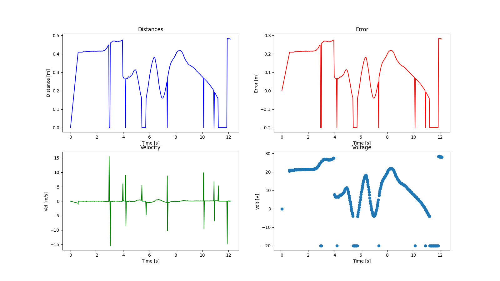

# Autonomous Rover with Computer Vision

<div align="center">


*Autonomous rover with depth perception and intelligent decision-making*

</div>

---

## 📖 Project Overview

This project implements an autonomous rover system capable of navigating its environment using computer vision and depth sensing. Developed as part of the **BEIFI Research Internship** at **Instituto Politécnico Nacional (IPN)**, the rover utilizes:

- **Intel RealSense Camera** for depth perception
- **NVIDIA Jetson Nano** for onboard AI processing
- **Proportional Control System** for autonomous navigation
- **Real-time Telemetry** for performance monitoring

### Key Features

✅ Real-time distance measurement using depth camera  
✅ Proportional control for smooth navigation  
✅ Obstacle detection and avoidance  
✅ Live telemetry visualization  
✅ Remote control capabilities via TCP  
✅ Comprehensive data logging and analysis  

---

## 🏗️ System Architecture

```
┌─────────────────────────────────────────────────┐
│              Intel RealSense D435               │
│          (Depth + RGB Camera @30fps)            │
└────────────────┬────────────────────────────────┘
                 │
                 ▼
┌─────────────────────────────────────────────────┐
│            NVIDIA Jetson Nano                   │
│  ┌──────────────────────────────────────────┐  │
│  │         Python Control System            │  │
│  │  • RoverCamera (Frame Acquisition)       │  │
│  │  • JetsonRover (Control Loop)            │  │
│  │  • Proportional Controller (PID)         │  │
│  └──────────────┬───────────────────────────┘  │
└─────────────────┼───────────────────────────────┘
                  │
                  ▼
        ┌─────────────────┐
        │  Arduino Board  │
        │  Motor Control  │
        └────────┬────────┘
                 │
                 ▼
        ┌─────────────────┐
        │   DC Motors     │
        │  (Locomotion)   │
        └─────────────────┘
```

---

## 📂 Project Structure

```
research_intern_beifi/
│
├── main.py                          # Main control system
├── requirements.txt                 # Python dependencies
├── README.md                        # This file
│
├── src/
│   ├── Core/
│   │   └── RoverCamera.py          # RealSense camera interface
│   │
│   ├── Client/
│   │   └── Client.py               # TCP client for remote control
│   │
│   ├── Server/
│   │   └── Server.py               # TCP server for rover
│   │
│   ├── Tools/
│   │   ├── realsense_camera.py    # Camera utilities
│   │   ├── realsense_depth.py     # Depth processing
│   │   ├── Open_Camera.py         # Simple camera viewer
│   │   ├── measure_object_distance.py  # Distance measurement
│   │   ├── mask_rcnn.py           # Instance segmentation
│   │   ├── MovingDetect.py        # Motion detection
│   │   └── Object_Detection_Tf.ipynb  # TensorFlow detection
│   │
│   ├── Test/
│   │   ├── Jetson_Rover_Test.py   # System tests
│   │   ├── Jetson_Rover.py        # Rover implementation
│   │   └── realsense_Rover.py     # Camera integration tests
│   │
│   ├── Simulations/
│   │   ├── Simulacion_1_ECD_PDI_Luis_Fernando.ipynb  # PID simulation
│   │   └── Simulacion_2_ECD_PDI_Luis_Fernando.ipynb  # Extended simulation
│   │
│   ├── Documentation/
│   │   ├── Rover.ipynb            # Interactive documentation
│   │   ├── Rover.html             # HTML documentation
│   │   └── Rover.pdf              # PDF documentation
│   │
│   └── img/                       # Images and diagrams
│       ├── jetson-nano.jpg
│       ├── Jetson.jpg
│       └── Test_1.png
│
└── Arduino_File/
    └── Arduino_File.ino            # Arduino motor control code
```

---

## 🚀 Getting Started

### Prerequisites

#### Hardware Requirements
- NVIDIA Jetson Nano (or compatible x86 system for simulation)
- Intel RealSense D435 Camera
- Arduino Board (for motor control)
- DC Motors with motor driver
- Power supply

#### Software Requirements
- Python 3.8 or higher
- CUDA Toolkit (for Jetson Nano)
- Arduino IDE (for motor controller)

### Installation

1. **Clone the repository**:
```bash
cd research_intern_beifi
```

2. **Create a virtual environment** (recommended):
```bash
python3 -m venv venv
source venv/bin/activate  # On Windows: venv\Scripts\activate
```

3. **Install dependencies**:
```bash
pip install -r requirements.txt
```

4. **Verify RealSense camera**:
```bash
python3 src/Tools/Open_Camera.py
```

### Running the Rover

#### 1. Start the Main Control System

```bash
python3 main.py
```

**Controls**:
- Press `ESC` to stop the rover and view telemetry

#### 2. Remote Control (Optional)

**On the Rover** (Server):
```bash
python3 src/Server/Server.py
```

**On the Control Station** (Client):
```bash
python3 src/Client/Client.py
```

Type commands to control the rover remotely. Type `bye` to disconnect.

#### 3. Run Simulations

```bash
jupyter notebook
# Navigate to src/Simulations/ and open the notebooks
```

---

## 🎮 Control System

### Proportional Controller

The rover uses a **proportional control** algorithm to maintain a target distance from obstacles:

```python
# Control equations
error = measured_distance - setpoint
voltage = Kp * error
direction = forward if error > 0 else reverse
```

**Parameters**:
- `setpoint = 0.2m` - Target distance
- `Kp = 100` - Proportional gain
- `max_voltage = 100V` - Voltage limit

### Telemetry Data

The system collects and visualizes:
- **Distance** over time
- **Error** (deviation from setpoint)
- **Velocity** (calculated from distance change)
- **Control voltage** output

---

## 📊 Example Results

After running the rover, you'll see telemetry graphs like:



**Typical Performance**:
- Distance measurement accuracy: ±2cm
- Frame rate: 30 FPS
- Control loop latency: <50ms
- Convergence time: ~5-10 seconds

---

## 🔧 Configuration

### Camera Settings

Edit in `src/Core/RoverCamera.py`:
```python
camera = RoverCamera(
    width=640,    # Frame width
    height=480,   # Frame height
    fps=30        # Frames per second
)
```

### Control Parameters

Edit in `main.py`:
```python
class JetsonRover:
    SETPOINT = 0.2        # Target distance (meters)
    KP_VOLTAGE = 100      # Proportional gain
    MAX_VOLTAGE = 100     # Maximum voltage
    TARGET_POINT = (320, 240)  # Center pixel
```

### Network Settings

Edit in `src/Client/Client.py` and `src/Server/Server.py`:
```python
HOST = '10.104.65.191'  # Rover IP address
PORT = 8485              # Communication port
```

---

## 🧪 Testing

### Camera Test
```bash
python3 src/Test/realsense_Rover.py
```

### Depth Measurement Test
```bash
python3 src/Tools/measure_object_distance.py
```

### Full System Test
```bash
python3 src/Test/Jetson_Rover_Test.py
```

---

## 📚 Documentation

- **Interactive Notebook**: Open `src/Documentation/Rover.ipynb` in Jupyter
- **PDF Manual**: See `src/Documentation/Rover.pdf`
- **API Documentation**: See docstrings in source files

---

## 🔬 Simulations

The `src/Simulations/` folder contains Jupyter notebooks that simulate the PID control system mathematically before deploying to hardware.

**Key Simulation Features**:
- Differential equation modeling
- Step response analysis
- Parameter tuning visualization
- Error convergence plots

**To run**:
```bash
jupyter notebook src/Simulations/Simulacion_1_ECD_PDI_Luis_Fernando.ipynb
```

---

## 🛠️ Development

### Code Style

This project follows:
- **PEP 8** style guide for Python
- **Type hints** for function signatures
- **Docstrings** for all classes and methods
- **Logging** instead of print statements

### Adding New Features

1. Create a new branch
2. Implement your feature with proper documentation
3. Test thoroughly
4. Submit a pull request

---

## 📈 Future Improvements

- [ ] Implement full PID controller (add integral and derivative terms)
- [ ] Add machine learning for object recognition
- [ ] Implement path planning algorithms
- [ ] Add sensor fusion (IMU + camera)
- [ ] Develop mobile app for control
- [ ] Implement SLAM (Simultaneous Localization and Mapping)
- [ ] Add battery monitoring and low-power modes
- [ ] Integrate GPS for outdoor navigation

---

## 🐛 Troubleshooting

### Camera Not Detected
```bash
# Check if camera is recognized
lsusb | grep Intel

# Restart udev rules
sudo udevadm control --reload-rules
sudo udevadm trigger
```

### Low Frame Rate
- Reduce resolution in `RoverCamera` initialization
- Close other applications using the camera
- Check USB 3.0 connection

### Import Errors
```bash
# Reinstall dependencies
pip install --force-reinstall -r requirements.txt
```

---

## 📝 License

This project is licensed under the MIT License - see the [LICENSE](../LICENSE) file for details.

---

## 👨‍💻 Author

**Luis Fernando**
- Institution: Instituto Politécnico Nacional (IPN)
- Program: BEIFI Research Internship
- Email: [your-email@example.com]
- GitHub: [@your-username](https://github.com/your-username)

---

## 🙏 Acknowledgments

- **Instituto Politécnico Nacional (IPN)** - Research support and facilities
- **BEIFI Program** - Research internship funding
- **Intel** - RealSense SDK and documentation
- **NVIDIA** - Jetson platform and CUDA support
- **OpenCV Community** - Computer vision tools

---

## 📚 References

1. Intel RealSense Documentation: https://dev.intelrealsense.com/
2. OpenCV Documentation: https://docs.opencv.org/
3. NVIDIA Jetson Documentation: https://developer.nvidia.com/embedded/jetson
4. PID Control Theory: Åström & Murray, "Feedback Systems"

---

<div align="center">

**[⬆ Back to top](#autonomous-rover-with-computer-vision)**

---

Made with ❤️ at IPN | *La Técnica al Servicio de la Patria*

</div>
